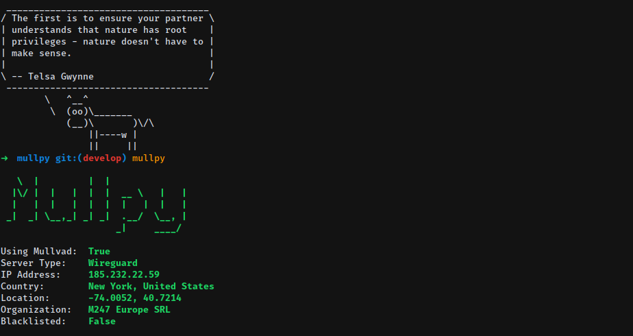

# Mullpy

A little tool to check if you're currently connected to **Mullvad** VPN or not. Read the _very flattering_ [Mullvad review here](https://thatoneprivacysite.net/2017/10/03/mullvad-review/) by [That One Privacy Site](https://thatoneprivacysite.net/)

The tool _does not_ intend to be a swiss army knife, just a weekend mini project so I don't have to go to [am.i.mullvad.net](http://am.i.mullvad.net/) everytime to check on my connection. **For WebRTC and DNS leaks you should go to their website!**



# Installation

**Requirements:**
* Python 3.6 and up.

**Instalation vía Pip:**
```bash
$ pip install --user mullvad-python
```

# Usage
```
$ mullpy
   \  |         |  |               
  |\/ |  |   |  |  |  __ \   |   | 
  |   |  |   |  |  |  |   |  |   | 
 _|  _| \__,_| _| _|  .__/  \__, | 
                     _|     ____/  

Using Mullvad:	True
Server Type:	Wireguard
IP Address:	185.232.22.59
Country:	New York, United States
Location:	-74.0052, 40.7214
Organization:	M247 Europe SRL
Blacklisted: 	False
```

# TODO
[x] CLI
[x] Testing
[x] Continuous Integration
[x] Code Coverage
[ ] Port Checking
[ ] DNS Leak Test
[ ] Verbose options
